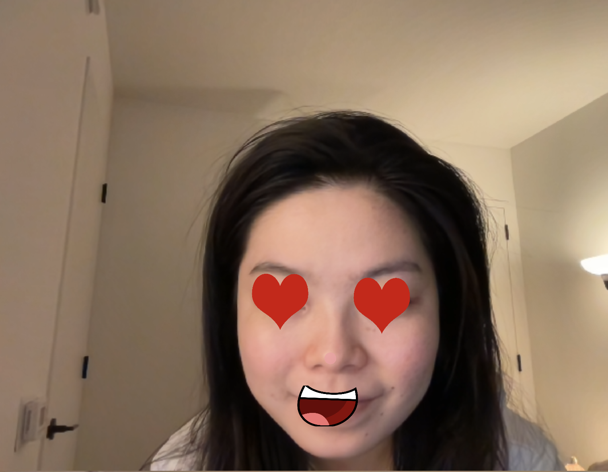

# First Trial
I attempted to use the faceApi to create face stickers for video makeup, and it functioned as a fun filter. It initially worked, but I'm not sure why it didn't display correctly after I made some changes to its settings.
Here is a screenshot:

# Second Trial
I experimented with the p5play library, and it turned out to be quite interesting! 
I developed a basic "fighting game" with two elements on an extended platform. When you click, they jump and collide with each other. Simultaneously, numerous balls descend from above. If the large square hits the balls, they are collected and disappear. However, if the big square falls off the platform, game is over.